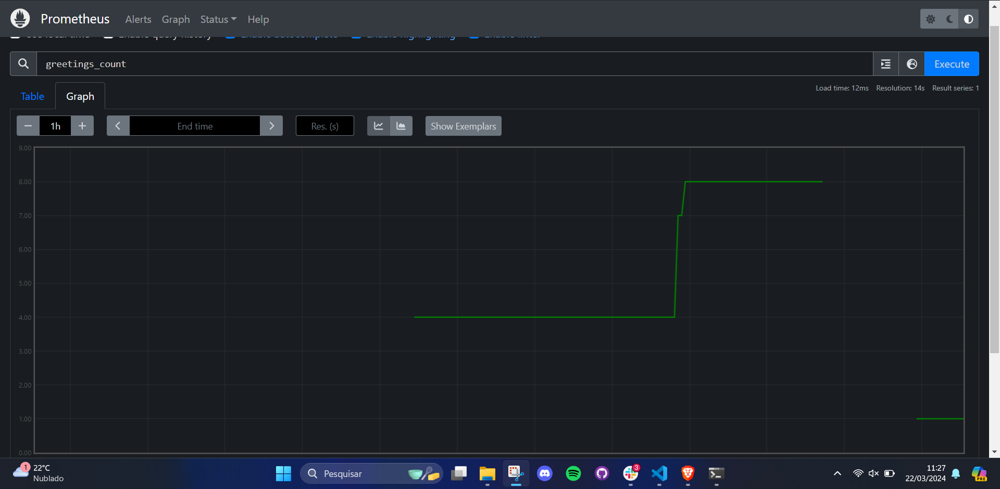
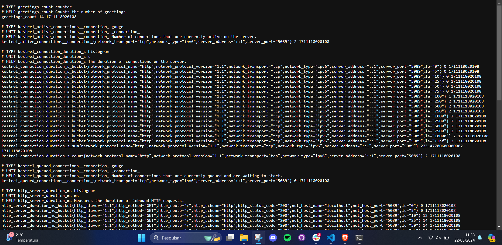
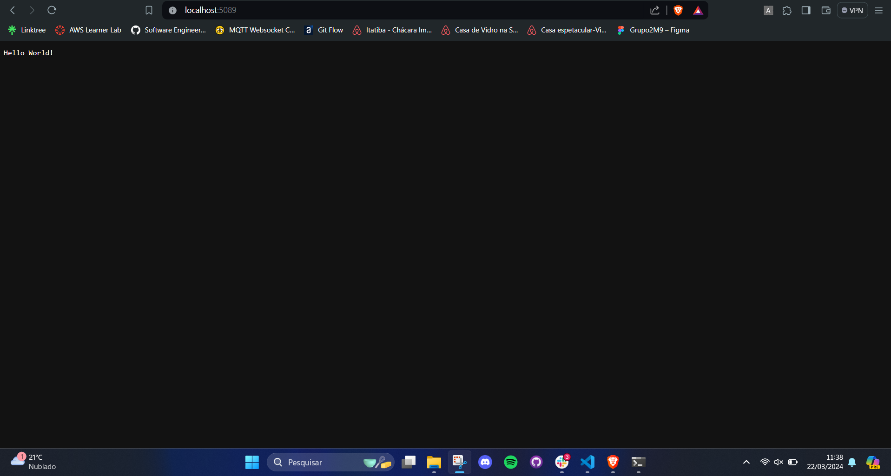
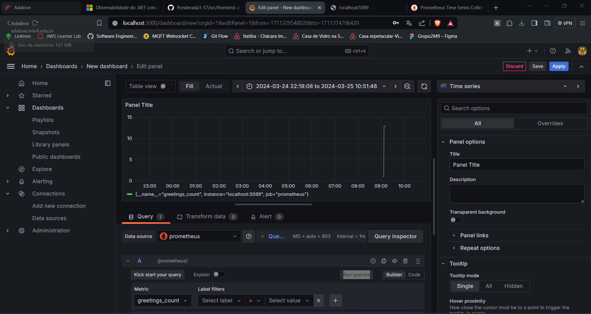

# Ponderada Métricas - Semana 7 Módulo 9

## Prometheus e Telemetry

Prometheus é uma plataforma aberta dedicada ao monitoramento, desenvolvida para capturar e reter métricas de sistemas e serviços em rede, além de facilitar consultas adaptáveis e criar alertas baseados em critérios personalizados. Por outro lado, Telemetry foca na normalização da forma como aplicativos são equipados para registrar telemetria, o que inclui o acompanhamento de requisições, a coleta de métricas e o registro de logs.

## Conceitos aprendidos

Durante o desenvolvimento da ponderada, foi possível mergulhar mo âmbito do monitoramento de softwares, bem como ampliar meu conhecimento no que tange a criação de métricas personalizadas que façam mais sentido de acordo com cada cenário. Como conclusão, aprender sobre o Prometeus será fundamental para o andamento do projeto.

## Código

### Adição do Telemetry

**No arquivo .csproj**

```
<ItemGroup>
    <PackageReference Include="OpenTelemetry.Exporter.Console" Version="1.5.0" />
    <PackageReference Include="OpenTelemetry.Exporter.OpenTelemetryProtocol" Version="1.5.0" />
    <PackageReference Include="OpenTelemetry.Exporter.Prometheus.AspNetCore" Version="1.5.0-rc.1" />
    <PackageReference Include="OpenTelemetry.Extensions.Hosting" Version="1.5.0" />
    <PackageReference Include="OpenTelemetry.Instrumentation.AspNetCore" Version="1.5.0-beta.1" />
    <PackageReference Include="OpenTelemetry.Instrumentation.Http" Version="1.5.0-beta.1" />
</ItemGroup>
  ```

  **No arquivo .cs**

  ```
    using System.Diagnostics;
    using System.Diagnostics.Metrics;
    using OpenTelemetry.Metrics;
    using OpenTelemetry.Resources;
    using OpenTelemetry.Trace;
  ```

 ### Criação da métrica

 ```
    var greeterMeter = new Meter("OtPrGrYa.Example", "1.0.0");
    var countGreetings = greeterMeter CreateCounter<int>("greetings.count", description: "Counts the number of greetings");
 ```

 ### Gráfico Prometeus em execução
<!--  -->


### Logs das métricas em execução


### Aplicação rodando


### Dashboard Greetings Count no Grafana
